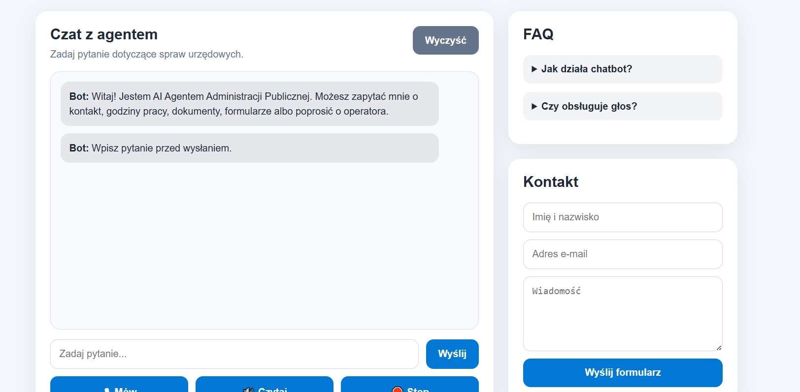

# 🤖 AI Agent Administracji Publicznej



## 📌 Opis projektu

AI Agent Administracji Publicznej to responsywna aplikacja webowa stworzona w technologii Next.js oraz React.

Celem projektu jest stworzenie inteligentnego asystenta wspierającego obywateli w uzyskiwaniu podstawowych informacji urzędowych. Agent odpowiada na pytania użytkowników na podstawie przygotowanej bazy wiedzy i pomaga w odnalezieniu informacji dotyczących dokumentów, formularzy, godzin pracy urzędu oraz kontaktu.

Projekt został wykonany jako aplikacja Single Page Application (SPA) z nowoczesnym interfejsem użytkownika, obsługą głosową oraz zapisem historii rozmów.

---

# 🎯 Cel projektu

Celem projektu było zaprojektowanie oraz implementacja inteligentnego agenta konwersacyjnego dostępnego z poziomu przeglądarki internetowej.

Agent umożliwia:

* prowadzenie rozmowy z użytkownikiem,
* wyszukiwanie odpowiedzi w bazie wiedzy,
* obsługę podstawowych spraw urzędowych,
* przechowywanie historii rozmowy,
* komunikację głosową.

---

# 🛠 Technologie

Projekt został wykonany z wykorzystaniem następujących technologii:

## Frontend

* Next.js
* React
* JavaScript (ES6+)
* HTML5
* CSS3

## Dodatkowe technologie

* LocalStorage
* Web Speech API
* Speech Recognition (STT)
* Speech Synthesis (TTS)
* Responsive Web Design

---

# 🏗 Architektura rozwiązania

```text
Użytkownik
      ↓
Interfejs React
      ↓
Chat Engine
      ↓
Knowledge Base
      ↓
Generowanie odpowiedzi
      ↓
Wyświetlenie odpowiedzi
```

---

# 📂 Struktura projektu

```text
ai-chatbot-gov/
│
├── app/
│   ├── page.js
│   ├── layout.js
│   └── globals.css
│
├── data/
│   └── knowledgeBase.js
│
├── README.md
└── package.json
```

---

# ⚙️ Funkcjonalności

## Chatbot

* wysyłanie wiadomości
* dynamiczne odpowiedzi
* wielokrotne interakcje
* historia rozmów
* czyszczenie historii
* walidacja danych wejściowych

## Knowledge Base

Bot korzysta z lokalnej bazy wiedzy zawierającej informacje dotyczące:

* kontaktu z urzędem,
* godzin pracy,
* dokumentów,
* formularzy,
* przekierowania do operatora.

## Voice Assistant

Aplikacja obsługuje:

### Speech To Text (STT)

Użytkownik może zadawać pytania głosowo.

### Text To Speech (TTS)

Bot może odczytywać odpowiedzi na głos.

## LocalStorage

Historia rozmów jest zapisywana lokalnie w przeglądarce użytkownika.

Po odświeżeniu strony rozmowa zostaje zachowana.

## Responsywność

Aplikacja poprawnie działa na:

* komputerach stacjonarnych,
* laptopach,
* tabletach,
* smartfonach.

---

# 📱 Interfejs użytkownika

Aplikacja zawiera:

* sekcję nagłówka,
* okno czatu,
* panel FAQ,
* formularz kontaktowy,
* przyciski sterowania głosowego,
* przycisk czyszczenia historii rozmowy.

---

# 🧪 Scenariusze testowe

## Test 1 — pytanie o kontakt

Wejście:

```text
Potrzebuję kontaktu do urzędu
```

Oczekiwany wynik:

```text
Dane kontaktowe znajdziesz w sekcji Kontakt.
```

---

## Test 2 — pytanie o godziny pracy

Wejście:

```text
Jakie są godziny pracy urzędu?
```

Oczekiwany wynik:

```text
Urząd pracuje od poniedziałku do piątku.
```

---

## Test 3 — pytanie o dokumenty

Wejście:

```text
Jakie dokumenty są potrzebne?
```

Oczekiwany wynik:

```text
W sprawie dokumentów przygotuj dowód osobisty oraz wymagany formularz.
```

---

## Test 4 — pytanie spoza zakresu

Wejście:

```text
Jaka będzie jutro pogoda?
```

Oczekiwany wynik:

```text
To pytanie jest poza zakresem agenta administracji publicznej.
```

---

## Test 5 — niezrozumiałe dane

Wejście:

```text
!!!!!!
```

Oczekiwany wynik:

```text
Nie mogę potwierdzić tej informacji.
```

---

# 🚀 Uruchomienie projektu

## Instalacja

```bash
npm install
```

## Uruchomienie środowiska developerskiego

```bash
npm run dev
```

Aplikacja będzie dostępna pod adresem:

```text
http://localhost:3000
```

---

# ♿ Dostępność

Projekt został przygotowany z uwzględnieniem podstawowych zasad dostępności:

* czytelny kontrast kolorów,
* obsługa klawiatury,
* responsywność,
* obsługa głosowa.

---

# 🔮 Możliwe rozszerzenia

* integracja z Microsoft Teams,
* integracja z Microsoft Copilot Studio,
* integracja z bazą danych,
* logowanie użytkowników,
* panel administratora,
* analiza statystyk rozmów,
* Progressive Web App (PWA),
* wykorzystanie modeli AI.

---

# 👨‍💻 Autor

Szymon Basiul tr20406

Projekt wykonany w ramach realizacji zadania projektowego:

**AI Agent Administracji Publicznej – inteligentny chatbot webowy wspierający obywateli w uzyskiwaniu informacji urzędowych.**
